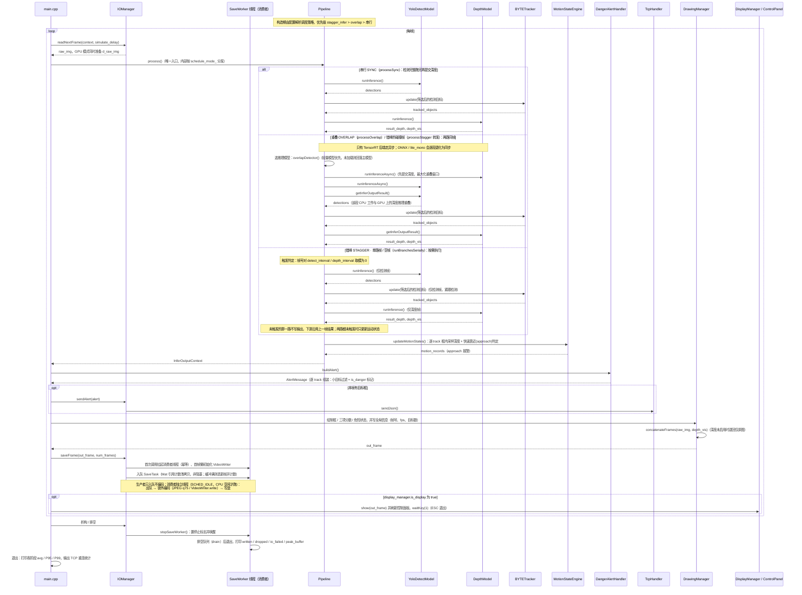

# 🚀 depth-detect：目标检测 + 深度融合框架

本项目是一个自行车智能后视镜系统，融合 **YOLO** 目标检测与 **单目/双目深度估计（Depth-Anything / Lite-Mono / YOLO-Depth）**，并在检测结果上叠加“快速靠近”（approach）判定：深度下降 + 目标框高增大且趋势持续，即视为危险目标并高亮、上报。兼容 x86 与嵌入式（aarch64，Jetson）平台，提供同步、重叠异步与错峰三种调度方式

[](https://www.youtube.com/watch?v=7MTgNl1jFrk)

**⭐ 快速亮点**

- 🎯 多模型并行（Depth + Detection）流水线（Sync / Async）
- ⏱️ 错峰推理（stagger）：检测 / 深度按各自间隔调度，同帧时自动走重叠推理，碰撞帧可切轻量检测模型
- ⚡ CUDA 前/后处理并行加速
- 📍 基于 BYTETracker 的多目标跟踪（阈值全部由配置驱动）
- 🚨 快速靠近（approach）检测：基线 + 累计变化率 + 进出双边去抖
- 📡 报警 JSON over TCP 上报
- 💾 异步落盘缓冲：上限可配，磁盘跟不上时丢新帧并计数告警，退出自动排空
- 🔧 支持跨平台构建（x86 / Jetson TX2 / Jetson Nano）

⚠️ **注意**：对于B站视频中旧版的代码，请运行（`release/v1.0` 是一个 **tag**，切换后会处于 detached HEAD）：

```bash
git fetch origin --tags
git checkout release/v1.0
```

---

## 📚 目录 (Table of Contents)

- [技术栈](#技术栈)
- [快速上手](#快速上手)
- [配置文件说明](#配置文件说明)
- [目录结构](#目录结构)
- [系统架构](#系统架构)
- [测试与基准](#测试与基准)
- [开发与贡献](#开发与贡献)

---

<a id="技术栈"></a>

## 🛠️ 技术栈

- 💻 语言：C++14
- 📦 构建：CMake 3.10
- 🎯 推理后端：TensorRT（兼容 8.x / 10.x）、ONNX Runtime 1.10（CPU 兜底）
- ⚙️ 并行/加速：CUDA、cuBLAS、cuDNN
- 🖼️ 视觉处理：OpenCV 4.x
- 🧩 配置/日志：yaml-cpp、spdlog
- ➗ 数值计算：Eigen3
- 🎚️ 滤波：1€ 滤波（第三方 `casiez/OneEuroFilter`）、OpenCV `cv::KalmanFilter`
- 📡 网络上报：nlohmann/json + TCP（子模块 `third_party/JsonSenderTest`）
- 📊 基准测试：Google Benchmark
- 🤖 算法：Yolo，DepthAnything，LiteMono，YoloDepth，BYTETracker
- 😀 平台：x86(Linux)、Jetson TX2 / Nano

---

<a id="快速上手"></a>

## 🚀 快速上手

1. 克隆仓库：

```bash
# Linux 和 Jeston 步骤相同
git clone https://github.com/yzfzzz/depth-detect.git
cd depth-detect
```

2. 一键运行

```bash
./start.sh
```

3. 构建 Docker 镜像（推荐）：
- 如果你希望在容器中运行项目，可以使用仓库根目录的 Dockerfile 构建镜像：

```bash
# 在仓库根目录构建容器
./build.sh
# 进入容器后一键运行
./start.sh
```

### 运行产物

| 位置                | 内容                                                                             |
| ------------------- | -------------------------------------------------------------------------------- |
| `bin/out_dir/`      | 输出结果（由 `io_manager.save_mode` 决定：`video` / `images` / `both` / `none`） |
| `bin/logs/`         | 运行日志（`logger.save_file` 控制）                                              |
| `bin/track_log.csv` | 每个 track 的类别 / 原始深度 / 框面积 / 帧数（`io_manager.save_track_log` 控制） |
| 终端                | 退出时打印各阶段 `avg / P95 / P99` 耗时汇总                                      |

---

### 报警上报

报警经 TCP 以 JSON 外发，结构为：

```json
{
  "timestamp": 0.0, "frame_id": 0, "img_w": 1280, "img_h": 720,
  "objects": [
    { "x": 0, "y": 0, "w": 0, "h": 0, "depth": 0,
      "class_id": 0, "track_id": 0,
      "velocity": 0, "ttc": -1, "is_danger": true }
  ]
}
```

- `objects` 包含本帧**所有通过小目标过滤、且已进入快速靠近（approach）判定单元**的目标，不限于危险目标；每条带 `is_danger` 标记（= approach 命中），是否报警由接收端取舍。
- 小目标过滤：面积 ≤ `min_object_area` 的目标直接丢弃；`car`（`class_id=2`）的阈值放大到 4 倍。
- `depth` 取 metric 深度图的框内均值，四舍五入到**整数米**（`std::lround`）；深度功能关闭时为 `0`。
- `timestamp` 用真实墙钟时间（Unix 秒），不是视频时间轴。
- `velocity` / `ttc` 是**旧 TTC 路遗留字段，仅为兼容保留**：现在不做 TTC 估计，分别固定为 `0` 与 `-1`。
- 连接建立与断联重连都由网络层（`TcpHandler`）负责；非 `CONNECTED` 状态下报警直接丢弃并计数，不排队重发。

---

<a id="目录结构"></a>

## 📁 目录结构

```
depth-detect/
├── cpp/
│   ├── main.cpp                  # 入口：读帧 → 推理 → 报警 → 绘制 → 落盘/显示
│   ├── include/                  # frame.h、memory.h（CUDA/TRT 智能指针）、public.h（CHECK_CUDA）
│   ├── core/                     # Pipeline、IOManager、MotionStateEngine、DangerAlertHandler
│   ├── inference/
│   │   ├── infer_backend/        # TensorRT / ONNX Runtime 后端抽象与工厂
│   │   └── infer_models/         # BaseModel、YoloDetectModel、DepthModel、YoloDepthModel
│   ├── op_kernel/                # CUDA 前/后处理核函数（.cu）
│   ├── bytetrack/                # ByteTrack + 卡尔曼 + LAPJV
│   ├── tools/                    # VisualManager、ControlPanel、ScopedTimer
│   └── utils/                    # ConfigManager、LoggerManager
├── benchmark/                    # Google Benchmark 与回归测试目标
├── scripts/                      # read_config.py、update_config.py（start.sh 配套）
├── start.sh / build.sh / format.sh
├── Dockerfile
├── bin/                          # 可执行文件、config.yaml、benchmark.yaml、out_dir、logs
├── model/                        # 模型仓库（git submodule，含 onnx/ 与 engine/）
├── third_party/                  # spdlog、onnxruntime、JsonSenderTest、OneEuroFilter
└── doc/                          # 架构图、CI 截图、公共代码说明
```

---

<a id="系统架构"></a>

## 📐 系统架构


### 推理调度

| 模式            | 触发条件                         | 行为                                                                                                                     |
| --------------- | -------------------------------- | ------------------------------------------------------------------------------------------------------------------------ |
| 串行            | 默认                             | 检测、深度依次调用同步接口                                                                                               |
| 重叠（overlap） | `prefer.overlap=true` 且未开错峰 | 两路 `runInferenceAsync` 后在 CUDA Stream 上取回结果                                                                     |
| 错峰（stagger） | `prefer.stagger_infer=true`      | 检测 / 深度各按 `detect_interval` / `depth_interval` 调度；同帧命中时转发重叠路径（yolo_depth 深度模型下用轻量检测模型） |

ONNX 后端不具备异步能力，重叠路径会自动退化为同步。

### 单帧数据流



---

<a id="测试与基准"></a>

## 📊 测试与基准（Benchmark）

项目集成 Google Benchmark 用于测量不同执行策略的吞吐/延迟

```bash
# 一键跑 5 项并汇总到 bin/benchmark.log（推荐）
./bin/run_benchmark.sh

# 单项执行（需先 cd 到 bin/）
cd ./bin && ./test_trt_pipeline && ./test_onnx_pipeline
# 量化专项
./test_trt_quant_latency && ./test_trt_quant_error
# 调度策略对照（串行 / 重叠 / 错峰的单帧耗时与降幅）
./test_schedule_strategy
```

资源占用侧另有 `scripts/jetson_monitor.py`：拉起或附着目标进程，按 0.2 s 采集内存 / 进程 CPU / 温度到进程退出，输出终端统计与 `--json` 原始序列（细节见脚本 `--help`）。

---

### Jetson TX2 实测（yolo26 系列 · 2026-09-25）

**测试环境**

| 项目     | 值                                                                            |
| -------- | ----------------------------------------------------------------------------- |
| 设备     | Jetson TX2（devkit，`board: quill`；2 × SM，Pascal sm_62）                    |
| 系统     | Linux 4.9.299-tegra aarch64，4 × 2035.2 MHz                                   |
| 功耗模式 | `NV Power Mode: MAXP_CORE_ARM`                                                |
| 推理后端 | TensorRT 8.2（FP16 / FP32）；ONNX Runtime 作 CPU 对照                         |
| 模型     | 检测 `yolo26s` / 轻量检测 `yolo26n` / 深度 `yolo26n-depth`（均 640×640 op11） |
| 代码版本 | `d1fab0e`                                                                     |

#### 1. 流水线单项耗时（`test_trt_pipeline` / `test_onnx_pipeline`）

- 检测 `yolo26s` + 深度 `yolo26n-depth`

| 阶段                          | TRT FP16   | ONNX CPU | 加速比    |
| ----------------------------- | ----------:| --------:| ---------:|
| E2E Sync（检测 + 深度串行）   | **100 ms** | 1910 ms  | **19.1×** |
| E2E Overlap（两路异步叠加）   | **97 ms**  | —        | —         |
| YOLO Inference                | 48 ms      | 815 ms   | 17.0×     |
| Depth Inference               | 51 ms      | 1091 ms  | 21.4×     |
| YOLO Preprocess               | 0.44 ms    | 8.2 ms   | 18.5×     |
| YOLO Postprocess              | 0.47 ms    | 2.8 ms   | 5.9×      |
| Depth Preprocess              | 0.44 ms    | 14.3 ms  | 32.9×     |
| Depth Postprocess             | 1.41 ms    | 8.0 ms   | 5.6×      |
| MotionStateEngine Postprocess | 1.12 ms    | 1.06 ms  | —         |

- `YoloInferenceAsync`（48 ms）与同步版**完全一致**；`DepthInferenceAsync`（49 ms）仅比同步版（51 ms）快 4%。
- 重叠模式相对串行只有约 **3%**（100 → 97 ms）

#### 2. 量化延迟与精度（`test_trt_quant_latency` / `test_trt_quant_error`）

| 精度 | Sync       | Overlap   | 相对 FP32                      |
| ---- | ----------:| ---------:| ------------------------------:|
| FP32 | 142 ms     | 141 ms    | 1.00×                          |
| FP16 | **100 ms** | **98 ms** | **1.42×**                      |
| INT8 | —          | —         | TX2 未产出（无可用 INT8 引擎） |

FP16 vs FP32 误差（同一视频取前 1000 帧）：

| 指标                           | 值                  |
| ------------------------------ | ------------------- |
| Depth MAE / RMSE               | 0.028688 / 0.051285 |
| Depth Rel                      | **0.17%**           |
| Depth Max Abs Error            | 2.085182            |
| YOLO Avg IoU                   | **0.9733**          |
| YOLO Avg Conf Diff             | 0.002987            |
| Class Mismatches / Count Diffs | 88 / 98             |

> 深度平均相对误差 0.17%，但单像素最大绝对误差 2.09 ，极少数离群像素会有跳变，按均值看精度损失可忽略。

#### 3. 真实视频端到端

配置：错峰 `stagger_infer`（`detect_interval=1` / `depth_interval=3`），主检测 yolo26s FP16，碰撞帧切轻量 yolo26n FP16，深度 yolo26n-depth FP16；关闭显示。

| 指标                       | 值                                                 |
| -------------------------- | -------------------------------------------------- |
| 端到端吞吐                 | **13.5 fps**（74.1 ms/帧，实测 5900 帧 / 437.3 s） |
| Infer Pipeline             | avg **68.71 ms**，P95 89.58 ms，P99 104.48 ms      |
| Cap Read                   | avg 2.62 ms（P99 10.29 ms）                        |
| IO H2D Copy                | 0.55 ms                                            |
| IO Send Alert / Save Frame | 0.16 ms / 0.04 ms                                  |

> 注意与上表的区别：benchmark 的 `E2E Sync`（100 ms / 10 fps）是**每帧都跑检测 + 深度**的保守口径；生产用的错峰配置每 3 帧才跑一次深度（中间复用上一次结果），因此端到端能到 13.5 fps。两者不是同一口径，不要互相折算。

**帧型拆解**（同一视频与配置的 nsys 采集，拆出两类帧各自的时间构成）：

|        | 非碰撞帧（占 2/3）         | 碰撞帧（占 1/3）                             |
| ------ | --------------------------:| --------------------------------------------:|
| 周期   | 62.5 ms                    | 97.3 ms                                      |
| GPU 忙 | 51.6 ms（82.6%）           | 85.9 ms（88.2%）                             |
| 构成   | 主检测 49.5 + 前后处理 2.1 | 轻量检测 30.2 + **深度 56.4** + 前后处理 1.8 |

#### 4. 资源占用

检测时长 436.84 s，0.2 s 间隔共 2186 个采样点，覆盖全片（224.4 s、6732 帧）

| 指标                  | 均值              | 峰值              | 峰值时刻            |
| --------------------- | -----------------:| -----------------:| -------------------:|
| 系统内存 used         | 3975 MB           | 4194 MB           | 428.6 s             |
| 进程 RSS / HWM        | 2272 MB / 2272 MB | 2481 MB / 2485 MB | 353.6 s / 436.2 s   |
| 进程 CPU              | 55.7%             | 120.0%            | 4.6 s（引擎加载期） |
| GPU 温度              | 37.2 °C           | **39.5 °C**       | 431.6 s             |
| MCPU / BCPU / PLL     | 35.1 °C           | 37.0 °C           | 362.0 s             |
| Tdiode / Tboard tegra | 37.1 °C / 32.7 °C | 39.3 °C / 34.0 °C | 422.8 s / 233.4 s   |

- 全程温度 28~40 °C，**未触发热节流**（TX2 上限约 85 °C）；内存峰值 4.2 GB（TX2 上限 8 GB），资源侧仍有富余。
- 本次采集未包含功耗（INA3221）与 GPU 占用。

复现命令：

```bash
# 基准套件（脚本会自行 cd 到 bin/）
./bin/run_benchmark.sh

# 资源监视（bin/ 下执行，与被测程序的 cwd 一致）
cd bin && python3 ../scripts/jetson_monitor.py \
  --exec "./main video_path config_jetson.yaml" \
  --json m.json
```

#### 5. 结论

- TRT FP16 相对 ONNX CPU 端到端 **19.1×** 加速，相对 FP32 **1.42×**，精度损失（深度 0.17%、检测 IoU 0.973）可忽略。
- 640×480 视频上错峰调度（检测 1 / 深度 3）做到 **13.5 fps**；瓶颈是深度模型（单次 56.4 ms）。
- TX2 只有 2 个 SM，**重叠（overlap）带不来收益**（+3%），提升必须靠减少计算量（剪枝 / 降深度频次 / 换轻量模型）。
- 内存与温度余量充足，说明限制在算力而非资源。

### 早期模型组对照：Jetson TX2 vs GeForce RTX 5060

> 下表为更早一轮的采集，技术方案进行了大改，模型组与上一节不同（TX2 用 yolo8n + lite_mono-tiny，5060 用 yolo26m + lite_mono-8m），**与上一节 yolo26 系列的数据不可直接互比**。

- GeForce RTX 5060（x86）：yolo26m + lite_mono-8m
- Jetson TX2（aarch64）：yolo8n + lite_mono-tiny

#### 1. 端到端延迟 (E2E Pipeline)

| 阶段        | TX2 (ONNX CPU) | TX2 (TRT GPU) | 5060 (ONNX CPU) | 5060 (TRT GPU) | TX2 加速比 | 5060 加速比 |
| ----------- |:--------------:|:-------------:|:---------------:|:--------------:|:----------:|:-----------:|
| E2E Sync    | 716 ms         | 62 ms         | 297 ms          | 7.04 ms        | **11.5×**  | **42.2×**   |
| E2E Overlap | —              | 59 ms         | —               | 6.70 ms        | —          | —           |

#### 2. 逐阶段延迟拆解

| 阶段              | TX2 ONNX/OpenCV | TX2 TRT/CUDA | 5060 ONNX/OpenCV | 5060 TRT/CUDA |
| ----------------- |:---------------:|:------------:|:----------------:|:-------------:|
| YOLO Preprocess   | 15 ms           | 2 ms         | 2.44 ms          | 0.560 ms      |
| YOLO Inference    | 432 ms          | 25 ms        | 215 ms           | 3.90 ms       |
| YOLO Postprocess  | 5 ms            | 2 ms         | 1.14 ms          | 0.354 ms      |
| Depth Preprocess  | 7 ms            | 1 ms         | 1.25 ms          | 0.325 ms      |
| Depth Inference   | 348 ms          | 36 ms        | 89.0 ms          | 3.28 ms       |
| Depth Postprocess | 8 ms            | 2 ms         | 1.64 ms          | 0.827 ms      |
| MSE Postprocess   | 5 ms            | 0 ms         | 1.60 ms          | 0.251 ms      |

#### 3. 量化延迟对比 (TRT FP32 vs FP16 vs INT8)

| 精度 | TX2 Sync | TX2 Overlap | 5060 Sync | 5060 Overlap |
| ---- |:--------:|:-----------:|:---------:|:------------:|
| FP32 | 76 ms    | 75 ms       | 13.4 ms   | 11.2 ms      |
| FP16 | 61 ms    | 59 ms       | 7.19 ms   | 6.29 ms      |
| INT8 | —        | —           | 7.05 ms   | 6.36 ms      |

| 加速比       | TX2       | 5060      |
| ------------ |:---------:|:---------:|
| FP16 vs FP32 | **1.25×** | **1.86×** |
| INT8 vs FP32 | —         | **1.90×** |

#### 4. 量化精度误差 (vs FP32 Baseline)

| 指标             | TX2 FP16  | 5060 FP16 | 5060 INT8    |
| ---------------- |:---------:|:---------:|:------------:|
| Depth MAE        | 0.000762  | 0.000088  | 0.014663     |
| Depth RMSE       | 0.001356  | 0.000125  | 0.022231     |
| Depth Rel%       | **0.89%** | **0.05%** | **10.22%** ⚠️ |
| YOLO Avg IoU     | 0.9843    | 0.9982    | 0.9041       |
| YOLO Conf Diff   | 0.001656  | 0.000857  | 0.214586     |
| Class Mismatches | 27        | 9         | 2592         |

---

**关键结论：**

|               | TX2              | 5060                              |
| ------------- |:----------------:|:---------------------------------:|
| ONNX→TRT 加速 | 11.5×            | 42.2×                             |
| FP16 精度损失 | 可忽略 (~0.9%)   | 可忽略 (~0.05%)                   |
| INT8 精度     | —                | Depth Rel 10.22%, YOLO IoU 0.90 ⚠️ |
| 推荐配置      | TRT FP16 Overlap | TRT FP16 Overlap                  |

TX2 不支持 INT8，两个平台 **FP16 是最佳平衡点**——延迟减半、精度几乎无损。

ps. 测试结果仅供参考，实际性能可能因硬件配置、模型大小、输入分辨率等因素而有所不同

<a id="开发与贡献"></a>

## 💬 开发与贡献

- 提交 PR 前请运行 `format.sh` 统一格式；CI 的 Format Check 会用 `git diff --exit-code` 校验，格式不一致会直接失败
- 确保 CI 全流程通过：格式检查 → 镜像构建推送 → 容器内 `start.sh` + 编译 → 容器内 ONNX 流水线冒烟测试（见 `.github/workflows/ci_pipeline.yml`）


---

## 📄 许可证

见仓库根目录 `LICENSE`

---

*✨ Generated by yzfzzz*
