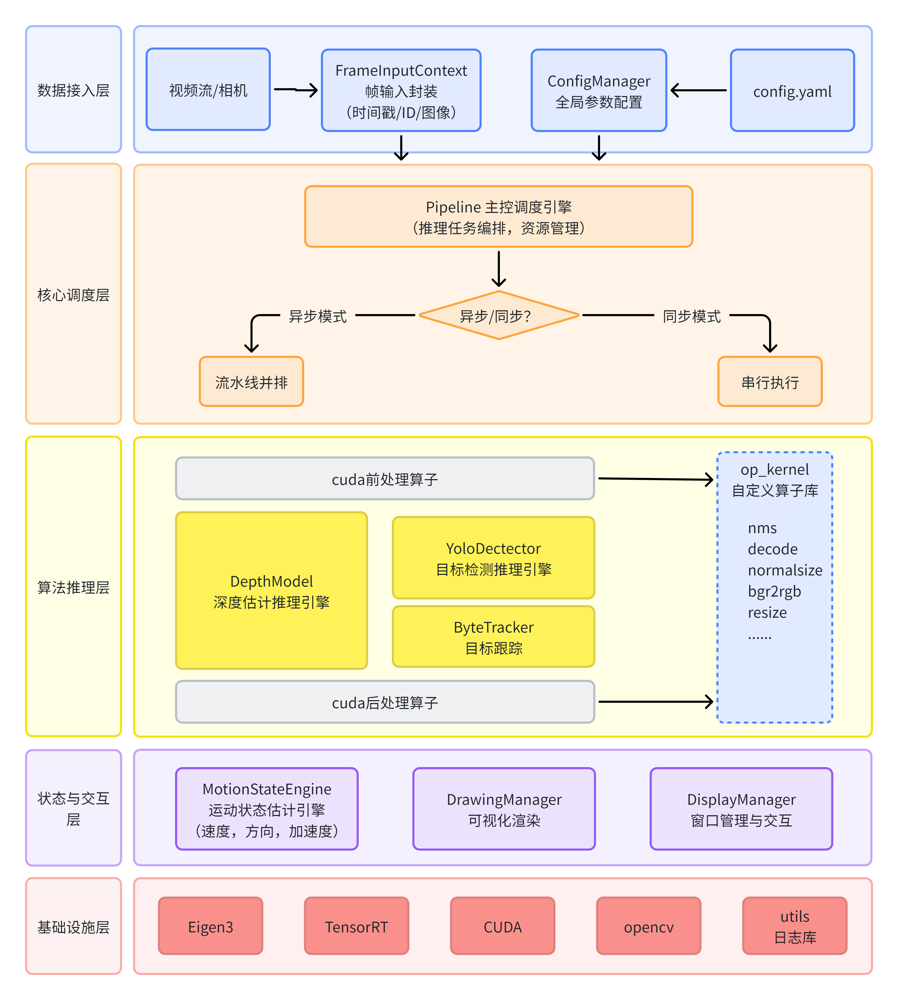
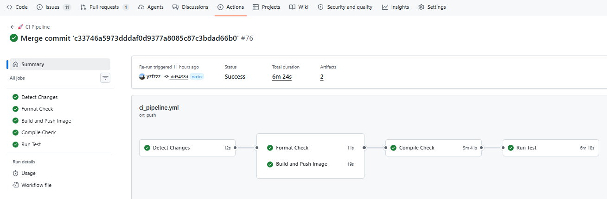

# 🚀 depth-detect：目标检测 + 深度融合框架

本项目是一个基于 C++ 与 TensorRT 的高性能视觉推理框架，融合 **YOLO** 目标检测与 **单目/双目深度估计（Depth-Anything / Lite-Mono）**，并在检测结果上叠加基于卡尔曼滤波的运动状态（速度 / 加速度 / 距离变化）估计。兼容 x86 与嵌入式（aarch64，Jetson）平台，提供同步与异步两种推理流水线

**⭐ 快速亮点**
- 🎯 多模型并行（Depth + Detection）流水线（Sync / Async）
- ⚡ CUDA 前/后处理并行加速（Resize、Normalize、NMS）
- 📍 基于 BYTETracker 的多目标跟踪 + 卡尔曼滤波运动平滑
- 🔧 支持跨平台构建（x86 / Jetson）

⚠️ **注意**：对于B站视频中旧版的代码，请运行：
```bash
git fetch origin
git checkout release/v1.0
```
---

## 📚 目录 (Table of Contents)
- [技术栈](#技术栈)
- [快速上手](#快速上手)
- [系统架构](#系统架构)
- [测试与基准](#测试与基准)
- [开发与贡献](#开发与贡献)

---

<a id="技术栈"></a>
## 🛠️ 技术栈

- 💻 语言：C++14
- 📦 构建：CMake 3.10
- 🎯 推理后端：TensorRT（兼容 8.x / 10.x）
- ⚙️ 并行/加速：CUDA、cuBLAS、cuDNN
- 🖼️ 视觉处理：OpenCV 4.x
- 📊 基准测试：Google Benchmark
- 🤖 算法：Yolo，DepthAnything，LiteMono，BYTETracker
- 😀 平台：x86(Linux)、Jetson

---

<a id="快速上手"></a>
## 🚀 快速上手

1. 克隆仓库：

```bash
# Linux 和 Jeston 步骤相同
git clone https://github.com/yzfzzz/depth-detect.git
cd depth-detect
```

2. 一键运行

```bash
./start.sh
```


3. 构建 Docker 镜像（推荐）：

- 如果你希望在容器中运行项目，可以使用仓库根目录的 Dockerfile 构建镜像：


```bash
# 在仓库根目录构建容器
./build.sh
# 进入容器后一键运行
./start.sh
```


---

<a id="系统架构"></a>
## 📐 系统架构



---


<a id="测试与基准"></a>
## 📊 测试与基准（Benchmark）

项目集成 Google Benchmark 用于测量不同执行策略的吞吐/延迟

```bash
cd ./bin && ./test_trt_pipeline && ./test_onnx_pipeline
```
从你的 benchmark 数据中提取关键指标，整理如下：

### 性能对比总表：Jetson TX2 vs GeForce RTX 5060
- GeForce RTX 5060（x86）：yolo26m + lite_mono-8m
- Jetson TX2（aarch64）：yolo8n + lite_mono-tiny
#### 1. 端到端延迟 (E2E Pipeline)

| 阶段 | TX2 (ONNX CPU) | TX2 (TRT GPU) | 5060 (ONNX CPU) | 5060 (TRT GPU) | TX2 加速比 | 5060 加速比 |
|------|:---:|:---:|:---:|:---:|:---:|:---:|
| E2E Sync | 716 ms | 62 ms | 297 ms | 7.04 ms | **11.5×** | **42.2×** |
| E2E Overlap | — | 59 ms | — | 6.70 ms | — | — |

#### 2. 逐阶段延迟拆解

| 阶段 | TX2 ONNX/OpenCV | TX2 TRT/CUDA | 5060 ONNX/OpenCV | 5060 TRT/CUDA |
|------|:---:|:---:|:---:|:---:|
| YOLO Preprocess | 15 ms | 2 ms | 2.44 ms | 0.560 ms |
| YOLO Inference | 432 ms | 25 ms | 215 ms | 3.90 ms |
| YOLO Postprocess | 5 ms | 2 ms | 1.14 ms | 0.354 ms |
| Depth Preprocess | 7 ms | 1 ms | 1.25 ms | 0.325 ms |
| Depth Inference | 348 ms | 36 ms | 89.0 ms | 3.28 ms |
| Depth Postprocess | 8 ms | 2 ms | 1.64 ms | 0.827 ms |
| MSE Postprocess | 5 ms | 0 ms | 1.60 ms | 0.251 ms |

#### 3. 量化延迟对比 (TRT FP32 vs FP16 vs INT8)

| 精度 | TX2 Sync | TX2 Overlap | 5060 Sync | 5060 Overlap |
|------|:---:|:---:|:---:|:---:|
| FP32 | 76 ms | 75 ms | 13.4 ms | 11.2 ms |
| FP16 | 61 ms | 59 ms | 7.19 ms | 6.29 ms |
| INT8 | — | — | 7.05 ms | 6.36 ms |

| 加速比 | TX2 | 5060 |
|------|:---:|:---:|
| FP16 vs FP32 | **1.25×** | **1.86×** |
| INT8 vs FP32 | — | **1.90×** |

#### 4. 量化精度误差 (vs FP32 Baseline)

| 指标 | TX2 FP16 | 5060 FP16 | 5060 INT8 |
|------|:---:|:---:|:---:|
| Depth MAE | 0.000762 | 0.000088 | 0.014663 |
| Depth RMSE | 0.001356 | 0.000125 | 0.022231 |
| Depth Rel% | **0.89%** | **0.05%** | **10.22%** ⚠️ |
| YOLO Avg IoU | 0.9843 | 0.9982 | 0.9041 |
| YOLO Conf Diff | 0.001656 | 0.000857 | 0.214586 |
| Class Mismatches | 27 | 9 | 2592 |

---

**关键结论：**

| | TX2 | 5060 |
|------|:---:|:---:|
| ONNX→TRT 加速 | 11.5× | 42.2× |
| FP16 精度损失 | 可忽略 (~0.9%) | 可忽略 (~0.05%) |
| INT8 精度 | — | Depth Rel 10.22%, YOLO IoU 0.90 ⚠️ |
| 推荐配置 | TRT FP16 Overlap | TRT FP16 Overlap |

TX2 不支持 INT8，两个平台 **FP16 是最佳平衡点**——延迟减半、精度几乎无损。

ps. 测试结果仅供参考，实际性能可能因硬件配置、模型大小、输入分辨率等因素而有所不同


<a id="开发与贡献"></a>
## 💬 开发与贡献

- 提交 PR 前请运行 `format.sh` 对代码进行格式化
- 确保 CI 流水线全部通过

---

## 📄 许可证

见仓库根目录 `LICENSE`

---


*✨ Generated by yzfzzz*
