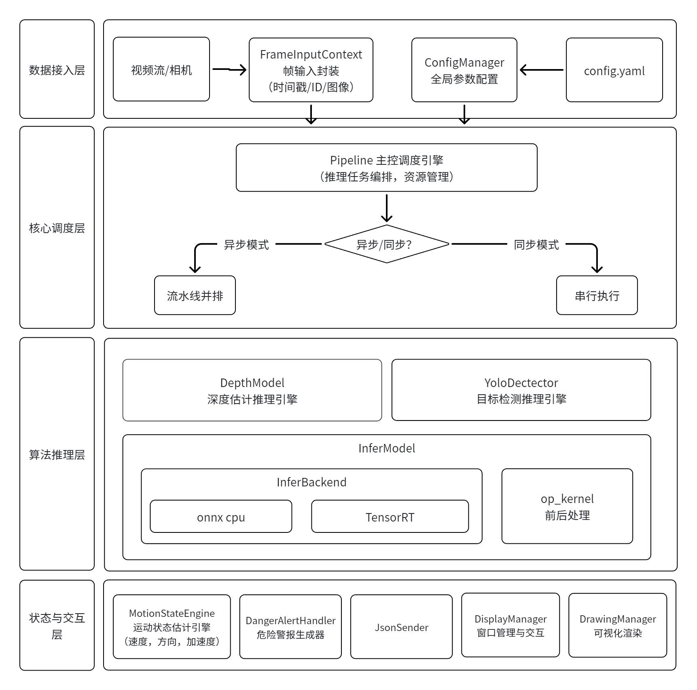
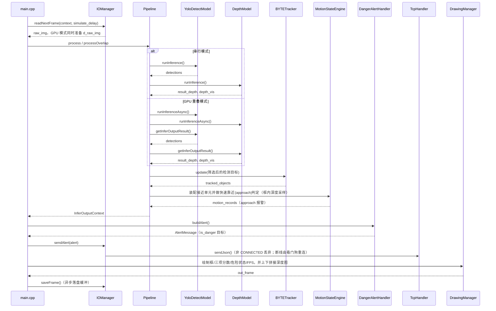

# 🚀 depth-detect：目标检测 + 深度融合框架

本项目是一个基于 C++ 与 TensorRT 的高性能视觉推理框架，融合 **YOLO** 目标检测与 **单目/双目深度估计（Depth-Anything / Lite-Mono / YOLO-Depth）**，并在检测结果上叠加“快速靠近”（approach）判定：深度下降 + 目标框高增大且趋势持续，即视为危险目标并高亮、上报。兼容 x86 与嵌入式（aarch64，Jetson）平台，提供同步、重叠异步与错峰三种调度方式


**⭐ 快速亮点**
- 🎯 多模型并行（Depth + Detection）流水线（Sync / Async）
- ⏱️ 错峰推理（stagger）：检测 / 深度按各自间隔调度，同帧时自动走重叠推理，碰撞帧可切轻量检测模型
- ⚡ CUDA 前/后处理并行加速（Resize、Normalize、NMS、深度后处理）
- 📍 基于 BYTETracker 的多目标跟踪（阈值全部由配置驱动）
- 🚨 快速靠近（approach）检测：基线 + 累计变化率 + 进出双边去抖
- 🎛️ 运行时参数控制面板：纯滑动条挂载在主显示窗口，拖动实时生效
- 📡 报警 JSON over TCP 上报，支持断线自动重连（看门狗探活）
- 💾 异步落盘缓冲：上限可配，磁盘跟不上时丢新帧并计数告警，退出自动排空
- 🔧 支持跨平台构建（x86 / Jetson TX2 / Jetson Nano）

⚠️ **注意**：对于B站视频中旧版的代码，请运行（`release/v1.0` 是一个 **tag**，切换后会处于 detached HEAD）：

```bash
git fetch origin --tags
git checkout release/v1.0
```
---

## 📚 目录 (Table of Contents)
- [技术栈](#技术栈)
- [快速上手](#快速上手)
- [配置文件说明](#配置文件说明)
- [目录结构](#目录结构)
- [系统架构](#系统架构)
- [测试与基准](#测试与基准)
- [开发与贡献](#开发与贡献)

---

<a id="技术栈"></a>
## 🛠️ 技术栈

- 💻 语言：C++14
- 📦 构建：CMake 3.10
- 🎯 推理后端：TensorRT（兼容 8.x / 10.x）、ONNX Runtime 1.10（CPU 兜底）
- ⚙️ 并行/加速：CUDA、cuBLAS、cuDNN
- 🖼️ 视觉处理：OpenCV 4.x
- 🧩 配置/日志：yaml-cpp、spdlog
- ➗ 数值计算：Eigen3
- 🎚️ 滤波：1€ 滤波（第三方 `casiez/OneEuroFilter`）、OpenCV `cv::KalmanFilter`
- 📡 网络上报：nlohmann/json + TCP（子模块 `third_party/JsonSenderTest`）
- 📊 基准测试：Google Benchmark
- 🤖 算法：Yolo，DepthAnything，LiteMono，YoloDepth，BYTETracker
- 😀 平台：x86(Linux)、Jetson TX2 / Nano

---

<a id="快速上手"></a>
## 🚀 快速上手

1. 克隆仓库：

```bash
# Linux 和 Jeston 步骤相同
git clone https://github.com/yzfzzz/depth-detect.git
cd depth-detect
```

2. 一键运行

```bash
./start.sh
```


3. 构建 Docker 镜像（推荐）：

- 如果你希望在容器中运行项目，可以使用仓库根目录的 Dockerfile 构建镜像：


```bash
# 在仓库根目录构建容器
./build.sh
# 进入容器后一键运行
./start.sh
```


### 运行产物

| 位置 | 内容 |
|---|---|
| `bin/out_dir/` | 输出结果（由 `io_manager.save_mode` 决定：`video` / `images` / `both` / `none`） |
| `bin/logs/` | 运行日志（`logger.save_file` 控制） |
| `bin/track_log.csv` | 每个 track 的类别 / 原始深度 / 框面积 / 帧数（`io_manager.save_track_log` 控制） |
| 终端 | 退出时打印各阶段 `avg / P95 / P99` 耗时汇总 |

---

### 报警上报

报警经 TCP 以 JSON 外发，结构为：

```json
{
  "timestamp": 0.0, "frame_id": 0, "img_w": 1280, "img_h": 720,
  "objects": [
    { "x": 0, "y": 0, "w": 0, "h": 0, "depth": 0,
      "class_id": 0, "track_id": 0,
      "velocity": 0, "ttc": -1, "is_danger": true }
  ]
}
```

- `objects` 只包含 `is_danger=true` 的目标（快速靠近判定命中且未被小目标过滤）。
- `depth` 走 metric 深度图，保留两位小数；深度功能关闭时为 `0`。
- `velocity` / `ttc` 是**旧 TTC 路遗留字段，仅为兼容保留**：现在不做 TTC 估计，分别固定为 `0` 与 `-1`。
- 连接建立与断联重连都由网络层（`TcpHandler`）负责；非 `CONNECTED` 状态下报警直接丢弃并计数，不排队重发。

---

<a id="目录结构"></a>
## 📁 目录结构

```
depth-detect/
├── cpp/
│   ├── main.cpp                  # 入口：读帧 → 推理 → 报警 → 绘制 → 落盘/显示
│   ├── include/                  # frame.h、memory.h（CUDA/TRT 智能指针）、public.h（CHECK_CUDA）
│   ├── core/                     # Pipeline、IOManager、MotionStateEngine、DangerAlertHandler
│   ├── inference/
│   │   ├── infer_backend/        # TensorRT / ONNX Runtime 后端抽象与工厂
│   │   └── infer_models/         # BaseModel、YoloDetectModel、DepthModel、YoloDepthModel
│   ├── op_kernel/                # CUDA 前/后处理核函数（.cu）
│   ├── bytetrack/                # ByteTrack + 卡尔曼 + LAPJV
│   ├── tools/                    # VisualManager、ControlPanel、ScopedTimer
│   └── utils/                    # ConfigManager、LoggerManager
├── benchmark/                    # Google Benchmark 与回归测试目标
├── scripts/                      # read_config.py、update_config.py（start.sh 配套）
├── start.sh / build.sh / format.sh
├── Dockerfile
├── bin/                          # 可执行文件、config.yaml、benchmark.yaml、out_dir、logs
├── model/                        # 模型仓库（git submodule，含 onnx/ 与 engine/）
├── third_party/                  # spdlog、onnxruntime、JsonSenderTest、OneEuroFilter
└── doc/                          # 架构图、CI 截图、公共代码说明
```

---

<a id="系统架构"></a>
## 📐 系统架构



### 推理调度

| 模式 | 触发条件 | 行为 |
|---|---|---|
| 串行 | 默认 | 检测、深度依次调用同步接口 |
| 重叠（overlap） | `prefer.overlap=true` 且未开错峰 | 两路 `runInferenceAsync` 后在 CUDA Stream 上取回结果 |
| 错峰（stagger） | `prefer.stagger_infer=true` | 检测 / 深度各按 `detect_interval` / `depth_interval` 调度；同帧命中时转发重叠路径（yolo_depth 深度模型下用轻量检测模型） |

ONNX 后端不具备异步能力，重叠路径会自动退化为同步。

### 单帧数据流



---

<a id="测试与基准"></a>
## 📊 测试与基准（Benchmark）

项目集成 Google Benchmark 用于测量不同执行策略的吞吐/延迟

```bash
cd ./bin && ./test_trt_pipeline && ./test_onnx_pipeline
# 量化专项
./test_trt_quant_latency && ./test_trt_quant_error
```


### 性能对比总表：Jetson TX2 vs GeForce RTX 5060
- GeForce RTX 5060（x86）：yolo26m + lite_mono-8m
- Jetson TX2（aarch64）：yolo8n + lite_mono-tiny
#### 1. 端到端延迟 (E2E Pipeline)

| 阶段 | TX2 (ONNX CPU) | TX2 (TRT GPU) | 5060 (ONNX CPU) | 5060 (TRT GPU) | TX2 加速比 | 5060 加速比 |
|------|:---:|:---:|:---:|:---:|:---:|:---:|
| E2E Sync | 716 ms | 62 ms | 297 ms | 7.04 ms | **11.5×** | **42.2×** |
| E2E Overlap | — | 59 ms | — | 6.70 ms | — | — |

#### 2. 逐阶段延迟拆解

| 阶段 | TX2 ONNX/OpenCV | TX2 TRT/CUDA | 5060 ONNX/OpenCV | 5060 TRT/CUDA |
|------|:---:|:---:|:---:|:---:|
| YOLO Preprocess | 15 ms | 2 ms | 2.44 ms | 0.560 ms |
| YOLO Inference | 432 ms | 25 ms | 215 ms | 3.90 ms |
| YOLO Postprocess | 5 ms | 2 ms | 1.14 ms | 0.354 ms |
| Depth Preprocess | 7 ms | 1 ms | 1.25 ms | 0.325 ms |
| Depth Inference | 348 ms | 36 ms | 89.0 ms | 3.28 ms |
| Depth Postprocess | 8 ms | 2 ms | 1.64 ms | 0.827 ms |
| MSE Postprocess | 5 ms | 0 ms | 1.60 ms | 0.251 ms |

#### 3. 量化延迟对比 (TRT FP32 vs FP16 vs INT8)

| 精度 | TX2 Sync | TX2 Overlap | 5060 Sync | 5060 Overlap |
|------|:---:|:---:|:---:|:---:|
| FP32 | 76 ms | 75 ms | 13.4 ms | 11.2 ms |
| FP16 | 61 ms | 59 ms | 7.19 ms | 6.29 ms |
| INT8 | — | — | 7.05 ms | 6.36 ms |

| 加速比 | TX2 | 5060 |
|------|:---:|:---:|
| FP16 vs FP32 | **1.25×** | **1.86×** |
| INT8 vs FP32 | — | **1.90×** |

#### 4. 量化精度误差 (vs FP32 Baseline)

| 指标 | TX2 FP16 | 5060 FP16 | 5060 INT8 |
|------|:---:|:---:|:---:|
| Depth MAE | 0.000762 | 0.000088 | 0.014663 |
| Depth RMSE | 0.001356 | 0.000125 | 0.022231 |
| Depth Rel% | **0.89%** | **0.05%** | **10.22%** ⚠️ |
| YOLO Avg IoU | 0.9843 | 0.9982 | 0.9041 |
| YOLO Conf Diff | 0.001656 | 0.000857 | 0.214586 |
| Class Mismatches | 27 | 9 | 2592 |

---

**关键结论：**

| | TX2 | 5060 |
|------|:---:|:---:|
| ONNX→TRT 加速 | 11.5× | 42.2× |
| FP16 精度损失 | 可忽略 (~0.9%) | 可忽略 (~0.05%) |
| INT8 精度 | — | Depth Rel 10.22%, YOLO IoU 0.90 ⚠️ |
| 推荐配置 | TRT FP16 Overlap | TRT FP16 Overlap |

TX2 不支持 INT8，两个平台 **FP16 是最佳平衡点**——延迟减半、精度几乎无损。

ps. 测试结果仅供参考，实际性能可能因硬件配置、模型大小、输入分辨率等因素而有所不同


<a id="开发与贡献"></a>
## 💬 开发与贡献

- 提交 PR 前请运行 `format.sh` 统一格式；CI 的 Format Check 会用 `git diff --exit-code` 校验，格式不一致会直接失败
- 确保 CI 全流程通过：格式检查 → 镜像构建推送 → 容器内 `start.sh` + 编译 → 容器内 ONNX 流水线冒烟测试（见 `.github/workflows/ci_pipeline.yml`）


---

## 📄 许可证

见仓库根目录 `LICENSE`

---


*✨ Generated by yzfzzz*
